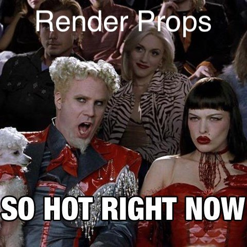

## Render Props > HOCs
One of the most convincing pieces of evidence that render props are a more powerful pattern than HOCs is the fact that any HOC can be implemented using a render prop, but the inverse is not true.

